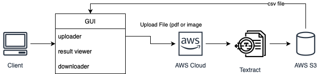

# PoE-Textract

PoE Textract is an Amazon Textract Tabular Formatted Parser Application for UoT Price of Empire project. The application can let users upload pdf or image files and scan the tabular data into csv files. 

## Table of Contents

- [Stack](#stack)
- [Pipeline](#pipeline)
- [Setup](#setup)
	- [Install](#install)
    - [Usage](#usage)
- [Deployment](#deployment)
- [Contributors](#contributors)
- [License](#license)

## Stack
- <strong>GUI</strong> Python Tkinter
- <strong>Data</strong> All data is saved in Amazon S3 and Amazon DynamoDB
- <strong>Processing</strong> Amazon Textract

## Pipeline


## Setup
### Set up AWS configuration
This app depends on AWS Textract service. An AWS account is needed. The default location of `AWS_SHARED_CREDENTIALS_FILE` and `AWS_CONFIG_FILE` are at `'~/.aws/credentials'` and `'~/.aws/config'`. Use 
```sh
$ aws configure
```
to set up your credentials and default region. For more details about AWS configuration, check [Boto3 1.28.5 documentation](https://boto3.amazonaws.com/v1/documentation/api/latest/guide/credentials.html).

### Install the required dependencies 

This project mainly depends on [Tkinter](https://docs.python.org/3/library/tkinter.html#module-tkinter)

```sh
$ pip install -r requirements.txt
```

## Usage
1.	Run the app:
    ```sh
    $ python file_uploader.py
    ```
2.	The FileUploader window will open.
3.	Click the "Upload File" button to select a PDF or image file.
4.	Once the file is uploaded, the file name will be displayed.
5.	Click the "Download File" button to save the uploaded file to a desired location.

## Deployment

## Contributors

## License
